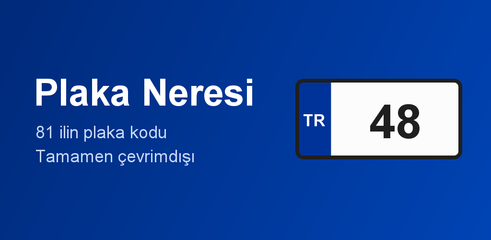

<p align="center">
  
</p>

<p align="center">
  
  
  
</p>

# Plaka Neresi

Every Turkish licence plate starts with a number that says where the car is registered.
Locals know the common ones. Nobody knows all 81.

Type `48`, get **Muğla**. Type `mugla`, `MUĞLA`, or `48` and get the same answer. The
whole province table is compiled into the APK, so the lookup works with no signal at all
— on a ferry, in the mountains, or abroad.

## Features

- **Code → province.** `48` → Muğla, `06` → Ankara, `34` → İstanbul.
- **Province → code.** Search by name, with or without Turkish characters.
- **Partial and colloquial input.** `mu` narrows as you type; `içel`, `urfa`, `antep`,
  `maraş`, `izmit` and `dersim` all resolve to the right province.
- **Browse all 81**, ordered by plate code or alphabetically.
- **Light / dark / system** theme, remembered between launches.
- **Offline.** The province data ships inside the app and is never fetched.

## The interesting part: Turkish text is a trap

`String.lowercase()` cannot be used anywhere near this data, and the failure is silent.

Turkish has two letter I's — dotted `İ/i` and dotless `I/ı` — and they are different
letters, not case variants of each other:

- Under a **Turkish locale**, `"ISPARTA".lowercase()` gives `"ısparta"`, so it stops
  matching the province `Isparta`.
- Under the **root locale**, `"İZMİR".lowercase()` gives `i` + `U+0307` (a combining dot)
  for each `İ` — a **7**-character string that never equals the 5-character `"izmir"`.

Either way, a tourist typing `izmir` on an English keyboard gets nothing, which is
precisely the case the app exists for. So `TurkishText.fold` maps every character
explicitly instead, producing identical results regardless of the phone's system language.

Sorting has the mirror-image problem: plain `String` comparison files *Çanakkale* after
*Zonguldak*, because `Ç` is `U+00C7`. The alphabetical list uses `java.text.Collator` with
a Turkish locale so it reads correctly — `... c, ç, d ...`, and `ı` before `i`.

## Matching rules

A query of only digits is treated as a code, anything else as a name. Results are ranked:

| Rank | Kind | Example |
|---|---|---|
| 1 | exact code | `48` → Muğla |
| 2 | code prefix | `4` → Ağrı (04) first, then 40–49 |
| 3 | name prefix | `mu` → Muğla before Gümüşhane |
| 4 | name contains | `hisar` → Afyonkarahisar |
| 5 | alias | `icel` → Mersin, `urfa` → Şanlıurfa |

Multi-word queries are matched piecewise, so `K. Maraş` and `kahraman maras` both reach
Kahramanmaraş even though the stored name is one unbroken run of letters.

## Building

Requires **JDK 17 or newer** and the Android SDK. Open in Android Studio and press Run, or:

```bash
./gradlew assembleDebug
```

All the domain logic is plain JVM code with no Android dependencies, so the tests run
without a device or emulator:

```bash
./gradlew test
```

### Release builds behave differently

R8 runs only in the release variant, so a minified-only crash is invisible to debug runs
and to every unit test. This project has already been bitten once: the ads SDK pulls in
WorkManager, WorkManager stores state in Room, Room loads its generated `WorkDatabase_Impl`
reflectively by name, and R8 stripped it — the app died inside
`androidx.startup.InitializationProvider` before any app code ran. The keep rules live in
[`app/proguard-rules.pro`](app/proguard-rules.pro).

Test the release build before shipping. To run one on an emulator without a release key,
sign it with the debug key:

```bash
./gradlew assembleRelease
apksigner sign --ks ~/.android/debug.keystore --ks-pass pass:android \
  --ks-key-alias androiddebugkey --key-pass pass:android \
  --out release-test.apk app/build/outputs/apk/release/app-release-unsigned.apk
adb install -r release-test.apk
```

Also worth testing with **3-button navigation**, not just gesture nav — the taller
navigation bar exposes inset bugs that gesture nav hides:

```bash
adb shell cmd overlay enable com.android.internal.systemui.navbar.threebutton
```

## Project layout

```
plates/            the whole domain, no Android imports — directly unit-testable
  Province.kt        one province; caches its folded name for search
  Provinces.kt       the 81-row table + Turkish-collated alphabetical order
  TurkishText.kt     character folding and tokenising
  PlateSearch.kt     query -> ranked hits
settings/
  SettingsStore.kt   the one persisted preference (theme)
ui/                Compose; knows nothing about how matching works
  PlateGraphics.kt   the plate visual, reused as list bullet and as the big answer
  HomeScreen.kt      search field, result card, browse list
  DetailsSheet.kt    top-bar action and the details bottom sheet
  AdBanner.kt        AdView wrapped for Compose
  theme/             colour schemes and ThemeMode
```

## A note on the data

Codes 01–67 were assigned in 1970, in alphabetical order of the province names of the day.
Every province created afterwards was simply appended — which is why the tail of the list
(68 Aksaray onward) is not alphabetical, and why a plate code roughly tells you how old a
province is.

## Ads

The app declares a single permission, `INTERNET`, used only by an anchored banner. The
lookup itself never touches the network. [`ads.xml`](app/src/main/res/values/ads.xml)
currently contains **Google's official test ad unit IDs** — safe to build and run, and
they must be replaced with real ones before publishing.

## Roadmap

- Voice input — say *"48 neresi"*, hear *"48 Muğla"*. Nothing in `plates/` assumes a
  keyboard, so this is mostly wiring `SpeechRecognizer` and `TextToSpeech` for `tr-TR`.
  Note that Android speech recognition is online by default; true offline needs the
  on-device Turkish language pack, so typing stays the primary path.
- Province detail view with region and an offline map.

## License

No licence file yet, so default copyright applies — the code can be read but not reused.
Add a `LICENSE` if you want that to change.
